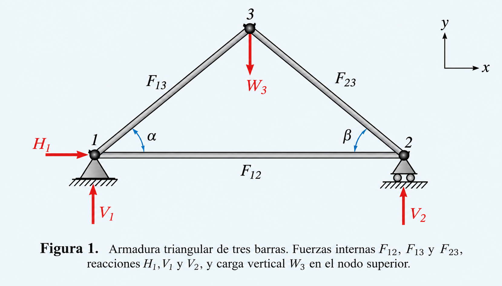

# Propósito

En el capítulo anterior aprendimos que trabajar con números de punto flotante obliga a distinguir entre el **problema matemático** y el **algoritmo** que usamos para resolverlo.

Ahora veremos esa distinción en uno de los problemas centrales del cálculo científico:

$$
Ax=b.
$$

Este documento está pensado para **tres clases de dos horas**:

1. **Clase 1:** de la interpolación a la factorización LU.
2. **Clase 2:** eficiencia, pivoteo, normas y condicionamiento.
3. **Clase 3:** laboratorio de problemas y experimentos en Pluto.

La pregunta que atravesará las tres clases será:

> **Julia produjo una respuesta. ¿Debemos confiar en ella?**

---

# Clase 1 — De un problema a un algoritmo
## Aplicación: fuerzas en una armadura

Antes de estudiar cómo resolver sistemas lineales, veamos cómo uno de ellos
aparece naturalmente a partir de un problema físico.

{width=85% fig-align="center"}


Los sistemas lineales no aparecen solamente como ejercicios de álgebra.
Surgen de manera natural al modelar problemas físicos.

Consideremos una armadura triangular formada por tres barras. Las fuerzas
internas en las barras son

$$
F_{12},\qquad F_{13},\qquad F_{23},
$$

y las reacciones en los apoyos son

$$
H_1,\qquad V_1,\qquad V_2.
$$

En el nodo superior actúa una carga vertical conocida \(W_3\).

La idea fundamental es sencilla:

> En cada nodo, la suma de las fuerzas horizontales y verticales debe ser cero.

### Ecuaciones de equilibrio

En el **nodo 1** tenemos

$$
V_1 + F_{13}\sin\alpha = 0,
$$

$$
H_1 + F_{12} + F_{13}\cos\alpha = 0.
$$

En el **nodo 2**,

$$
V_2 + F_{23}\sin\beta = 0,
$$

$$
-F_{12} - F_{23}\cos\beta = 0.
$$

Finalmente, en el **nodo 3**,

$$
-F_{13}\sin\alpha-F_{23}\sin\beta=W_3,
$$

$$
-F_{13}\cos\alpha+F_{23}\cos\beta=0.
$$

Tenemos entonces seis ecuaciones lineales para las seis incógnitas

$$
x=
\begin{pmatrix}
V_1\\
H_1\\
V_2\\
F_{12}\\
F_{13}\\
F_{23}
\end{pmatrix}.
$$

El sistema puede escribirse como

$$
Ax=b,
$$

donde

$$
A=
\begin{pmatrix}
1&0&0&0&\sin\alpha&0\\
0&1&0&1&\cos\alpha&0\\
0&0&1&0&0&\sin\beta\\
0&0&0&-1&0&-\cos\beta\\
0&0&0&0&-\sin\alpha&-\sin\beta\\
0&0&0&0&-\cos\alpha&\cos\beta
\end{pmatrix},
$$

y

$$
b=
\begin{pmatrix}
0\\
0\\
0\\
0\\
W_3\\
0
\end{pmatrix}.
$$

### Un caso concreto

Tomemos

$$
\alpha=\beta=45^\circ,
\qquad
W_3=1000\;\text{N}.
$$

En Julia:

```{julia}
using LinearAlgebra

α = deg2rad(45.0)
β = deg2rad(45.0)
W3 = 1000.0

A_truss = [
    1.0  0.0  0.0   0.0       sin(α)    0.0;
    0.0  1.0  0.0   1.0       cos(α)    0.0;
    0.0  0.0  1.0   0.0       0.0       sin(β);
    0.0  0.0  0.0  -1.0       0.0      -cos(β);
    0.0  0.0  0.0   0.0      -sin(α)   -sin(β);
    0.0  0.0  0.0   0.0      -cos(α)    cos(β)
]

b_truss = [0.0, 0.0, 0.0, 0.0, W3, 0.0]

x_truss = A_truss \ b_truss
```

Las componentes de `x_truss` corresponden, en este orden, a

$$
(V_1,H_1,V_2,F_{12},F_{13},F_{23}).
$$

Para este caso obtenemos aproximadamente

$$
V_1=500\;\text{N},
\qquad
H_1=0,
\qquad
V_2=500\;\text{N},
$$

y

$$
F_{12}=500\;\text{N},
\qquad
F_{13}\approx-707.1\;\text{N},
\qquad
F_{23}\approx-707.1\;\text{N}.
$$

El signo de las fuerzas internas depende de la convención adoptada. Con la
convención anterior, los valores negativos indican que la dirección real de
la fuerza es opuesta a la que supusimos inicialmente.

### ¿Qué queremos observar?

El punto importante no es solamente obtener seis números.

El proceso fue

$$
\text{estructura física}
\longrightarrow
\text{equilibrio de fuerzas}
\longrightarrow
\text{ecuaciones lineales}
\longrightarrow
Ax=bahi cabron ya 
\longrightarrow
\text{solución numérica}.
$$

> **Pregunta para la clase:**  
> ¿Qué información física está contenida en la matriz \(A\), qué información
> está contenida en \(b\), y qué representan las componentes de \(x\)?

Este ejemplo está basado en el tratamiento de fuerzas en una armadura
presentado por Laurene V. Fausett en *Applied Numerical Analysis Using MATLAB*.

##  Interpolación polinomial

Dados $n$ puntos $(t_i,y_i)$ buscamos un polinomio de grado menor que $n$,

$$
p(t)=c_1+c_2t+\cdots+c_nt^{n-1},
$$

tal que $p(t_i)=y_i$. Estas condiciones producen

$$
\begin{bmatrix}
1&t_1&\cdots&t_1^{n-1}\\
1&t_2&\cdots&t_2^{n-1}\\
\vdots&\vdots&&\vdots\\
1&t_n&\cdots&t_n^{n-1}
\end{bmatrix}c=y.
$$

La matriz es una **matriz de Vandermonde**. Así, un problema de interpolación nos conduce naturalmente a

$$
Vc=y.
$$

> Muchos problemas que aparentemente no tienen nada que ver con álgebra lineal terminan convertidos en un sistema lineal.

### Experimento Pluto

```julia
t = [0.0,1.0,2.0,3.0]
y = [1.0,2.0,0.0,5.0]
V = [t[i]^j for i in 1:length(t), j in 0:length(t)-1]
c = V \ y
V*c - y
```

**Predice antes de ejecutar:** ¿qué representa `c`? ¿Por qué el residuo no tiene que ser exactamente cero?

##  Matrices en Julia

```julia
using LinearAlgebra

A = [1.0 2.0 3.0;
     4.0 5.0 6.0;
     7.0 8.0 10.0]

b = [1.0,2.0,3.0]

size(A)
A'
A*b
```

Una matriz no es solamente una tabla de números. Numéricamente conviene pensarla como una transformación lineal.

##  El problema central: $Ax=b$

Si $A$ es invertible, matemáticamente

$$
x=A^{-1}b.
$$

Pero eso **no** significa que debamos calcular la inversa.

En Julia usamos

```julia
x = A \ b
```

y no

```julia
x = inv(A)*b
```

> **Regla práctica:** no calcule la inversa de una matriz para resolver un sistema lineal.

La expresión matemática y el algoritmo numérico no son la misma cosa.

##  El residuo

Si Julia produce $\tilde{x}$, podemos calcular

$$
r=b-A\tilde{x}.
$$

```julia
x = A \ b
r = b - A*x
norm(r)
```

Guardemos una pregunta para más adelante:

> ¿Un residuo pequeño garantiza que $\tilde{x}$ está cerca de la solución verdadera?
### Laboratorio: un circuito eléctrico como sistema lineal

Las leyes de Ohm y Kirchhoff conducen a un sistema lineal para las
corrientes de un circuito. En el siguiente laboratorio podrás modificar
los voltajes, resolver el sistema y observar también su residuo y
condicionamiento.

👉 [**Explorar el circuito de tres mallas en Pluto**](circuito_kirchhoff_pluto.jl)

> **Predice → mueve → observa → explica.**

##  Sistemas triangulares

Si $L$ es triangular inferior, $Lx=b$ se resuelve desde la primera ecuación hacia la última: **sustitución hacia adelante**.

Si $U$ es triangular superior, usamos **sustitución hacia atrás**.

```julia
function forwardsub(L,b)
    n = length(b)
    x = zeros(Float64,n)
    x[1] = b[1]/L[1,1]
    for i in 2:n
        s = sum(L[i,j]*x[j] for j in 1:i-1)
        x[i] = (b[i]-s)/L[i,i]
    end
    return x
end
```

Aquí no queremos que un paquete esconda el algoritmo. Queremos verlo respirar.

##  Factorización LU

Buscamos

$$
A=LU.
$$

Entonces

$$
Ax=b
\quad\Longrightarrow\quad
LUx=b.
$$

Definiendo $z=Ux$, resolvemos

$$
Lz=b,\qquad Ux=z.
$$

👉 [**Factorización LU de una matriz 4×4: ejemplo paso a paso y ejercicio**](factorizacion_LU_4x4.pdf)


Por tanto:

1. Factorizar $A=LU$.
2. Resolver $Lz=b$.
3. Resolver $Ux=z$.

Si tenemos muchos lados derechos $b_1,b_2,\ldots$, la factorización de $A$ se hace una sola vez.

```julia
F = lu(A)
x1 = F \ b1
x2 = F \ b2
```

## 7. Cierre de la primera clase

$$
\text{interpolación}\to Ax=b\to\text{sistemas triangulares}\to A=LU.
$$

Quedan dos preguntas:

> ¿Cuánto cuesta el algoritmo?

> ¿Siempre funciona bien?

---

# Clase 2 — ¿Rápido significa bueno?

##  Eficiencia y notación asintótica

Nos interesa cómo crece el trabajo con el tamaño $n$.

$$
n^2+3n+7=O(n^2),\qquad
4n^3+2n^2=O(n^3).
$$

Un **flop** es una operación aritmética de punto flotante.

El producto matriz-vector requiere aproximadamente

$$
2n^2
$$

flops, mientras que LU requiere aproximadamente

$$
\frac{2}{3}n^3.
$$

La factorización es la parte cara.

### Experimento Pluto: ver aparecer $n^2$

```julia
function tiempo_mv(n)
    A = randn(n,n)
    x = randn(n)
    A*x
    @elapsed A*x
end

t1 = tiempo_mv(1000)
t2 = tiempo_mv(2000)
t2/t1
```

**Predice:** si el trabajo es $O(n^2)$, ¿qué razón esperamos aproximadamente al duplicar $n$?

##  El problema del pivote

LU sin intercambiar filas puede fallar aunque $A$ sea invertible:

$$
A=
\begin{bmatrix}
0&1\\
1&1
\end{bmatrix}.
$$

El primer pivote es cero, pero $\det(A)=-1$.

La eliminación necesita intercambiar filas.

##  Pivoteo parcial y estabilidad

Al trabajar en una columna elegimos como pivote el elemento disponible de mayor valor absoluto.

No se hace sólo para evitar dividir entre cero. También importa la estabilidad.

Considere

$$
A(\varepsilon)=
\begin{bmatrix}
-\varepsilon&1\\
1&-1
\end{bmatrix}.
$$

Si $\varepsilon$ es diminuto, usarlo como pivote produce números enormes durante la eliminación.

```julia
ϵ = 1e-12
A = [-ϵ 1.0; 1.0 -1.0]
b = A*[1.0,1.0]
x = A \ b
A, b, x
```

> Un problema bien condicionado puede producir una mala respuesta si usamos un algoritmo inestable.

##  Normas

Necesitamos medir tamaños y perturbaciones:

$$
\|x\|_1=\sum_i|x_i|,
\qquad
\|x\|_2=\left(\sum_i|x_i|^2\right)^{1/2},
\qquad
\|x\|_\infty=\max_i|x_i|.
$$

```julia
x = [2.0,-3.0,1.0,-1.0]
norm(x,1)
norm(x,2)
norm(x,Inf)
```

Para una norma matricial inducida,

$$
\|A\|=\max_{x\ne0}\frac{\|Ax\|}{\|x\|},
$$

y por tanto

$$
\|Ax\|\leq\|A\|\|x\|.
$$

##  Condicionamiento de $Ax=b$

Si

$$
Ax=b
$$

y perturbamos $b$,

$$
A(x+\Delta x)=b+\Delta b,
$$

entonces

$$
\Delta x=A^{-1}\Delta b.
$$

Usando las desigualdades de las normas obtenemos

$$
\frac{\|\Delta x\|}{\|x\|}
\leq
\|A\|\|A^{-1}\|
\frac{\|\Delta b\|}{\|b\|}.
$$

Esto motiva

$$
\boxed{\kappa(A)=\|A\|\|A^{-1}\|}.
$$

Siempre $\kappa(A)\ge1$. Si $\kappa(A)\approx10^t$, pueden perderse aproximadamente $t$ cifras decimales de precisión.

```julia
cond(A)
```

##  El gran experimento Pluto: Hilbert

$$
H_{ij}=\frac{1}{i+j-1}.
$$

```julia
hilbert(n) = [1.0/(i+j-1) for i in 1:n, j in 1:n]

n = 6
H = hilbert(n)

x_exacta = ones(n)
b = H*x_exacta
x_calculada = H \ b

κ = cond(H)
error_relativo = norm(x_calculada-x_exacta)/norm(x_exacta)
residuo_relativo = norm(b-H*x_calculada)/norm(b)

κ, error_relativo, residuo_relativo
```

Después pruebe `n = 10` y `n = 14`.

La pregunta incómoda:

> ¿Podemos obtener simultáneamente un residuo muy pequeño y una respuesta muy inexacta?

Sí. Un residuo pequeño no garantiza un error pequeño cuando el problema está mal condicionado.
### Cuaderno interactivo

👉 [**Explorar matrices de Hilbert en Pluto**](hilbert_interactivo_pluto.jl)

En este cuaderno, una regleta permite variar la dimensión \(n\) y observar
simultáneamente cómo cambian el número de condición, el error relativo
y el residuo relativo.

> **Regla del experimento:** predice → mueve → observa → explica.

##  Error hacia adelante y hacia atrás

El residuo

$$
r=b-A\tilde{x}
$$

implica

$$
A\tilde{x}=b-r.
$$

Por tanto, $\tilde{x}$ es la solución exacta de un problema ligeramente perturbado. Ésta es la idea del **error hacia atrás**.

El condicionamiento conecta ambos mundos:

$$
\frac{\|x-\tilde{x}\|}{\|x\|}
\lesssim
\kappa(A)\frac{\|r\|}{\|b\|}.
$$

Como brújula conceptual:

$$
\boxed{
\text{error final}
\approx
\text{condicionamiento del problema}
\times
\text{error del algoritmo}
}
$$

##  La estructura también es información

Una matriz puede ser triangular, tridiagonal, de banda, dispersa, simétrica o definida positiva.

Esa información puede cambiar el algoritmo y el costo.

### Tridiagonal

```julia
n = 1000
A = Tridiagonal(-ones(n-1), 2ones(n), -ones(n-1))
b = ones(n)
x = A \ b
```

### Simétrica definida positiva

Para una matriz SPD podemos usar Cholesky,

$$
A=R^TR,
$$

con costo aproximado

$$
\frac13n^3
$$

en vez de $\frac23n^3$ de LU general.

```julia
A = randn(5,5)
B = A'*A + I
F = cholesky(B)
```

> **Antes de escoger un algoritmo, pregunte qué sabe acerca de la matriz.**

---

# Clase 3 — Laboratorio: predice, ejecuta, observa, explica

##  Regla del laboratorio

Para cada experimento:

1. **Predice.**
2. **Ejecuta.**
3. **Observa.**
4. **Explica.**

No queremos saber solamente qué comando escribir. Queremos saber qué pregunta hacerle al resultado.

##  Problema 1 — ¿Inversa o sistema?

```julia
A = randn(500,500)
b = randn(500)

@elapsed A\b
@elapsed inv(A)*b
```

Repita varias veces.

**Discuta:** ¿cuál es conceptualmente apropiado?, ¿cuál es más rápido?, ¿por qué calcular información que no necesitamos?

##  Problema 2 — El residuo puede engañar

```julia
H = hilbert(12)
x_exacta = ones(12)
b = H*x_exacta
x = H\b

norm(b-H*x)/norm(b)
norm(x-x_exacta)/norm(x_exacta)
cond(H)
```

Julia produjo una respuesta con residuo pequeño.

> **¿Debemos confiar en ella?**

##  Problema 3 — Perturbar los datos

```julia
A = [1.0 1.0; 1.0 1.000001]
x_exacta = [1.0,1.0]
b = A*x_exacta

cond(A)

δb = [1e-8,-1e-8]
x1 = A\b
x2 = A\(b+δb)

norm(δb)/norm(b)
norm(x2-x1)/norm(x1)
```

Explique cómo una perturbación diminuta puede producir un cambio mucho mayor en la solución.

##  Problema 4 — El pivote rebelde

Use

$$
A(\varepsilon)=
\begin{bmatrix}
-\varepsilon&1\\
1&-1
\end{bmatrix}
$$

para $\varepsilon=10^{-2},10^{-6},10^{-12}$.

Calcule `cond(A)` y resuelva con `A\b`.

Si el condicionamiento no explica una pérdida catastrófica pero una eliminación sin pivoteo sí puede producirla:

> **¿el problema está en el problema matemático o en el algoritmo?**

##  Problema 5 — El costo tiene pendiente

Mida tiempos para multiplicación matriz-vector con

```julia
ns = [250,500,1000,2000]
```

Si $t\approx Cn^p$, entonces

$$
p\approx
\frac{\log(t_2/t_1)}{\log(n_2/n_1)}.
$$

¿Se acerca a 2? ¿Por qué no tiene que dar exactamente 2?

##  Problema 6 — La estructura vale dinero

```julia
n = 2000

A_densa = diagm(
    -1 => -ones(n-1),
     0 =>  2ones(n),
     1 => -ones(n-1)
)

A_tri = Tridiagonal(
    -ones(n-1),
     2ones(n),
    -ones(n-1)
)
```

Resuelva ambos sistemas con el mismo $b$ y compare tiempo y memoria.

Las matrices representan el mismo operador.

> ¿Por qué no representan el mismo problema computacional?

##  Problema 7 — Vandermonde regresa por la puerta trasera

Para

$$
t_i=\frac{i}{n},\qquad i=0,\ldots,n,
$$

construya matrices de Vandermonde para distintos $n$ y calcule `cond(V)`.

La interpolación fue nuestra puerta de entrada al capítulo.

> Ahora que conocemos condicionamiento, ¿qué descubrimos sobre esa puerta?

##  Problema final — Diagnóstico numérico

Un compañero afirma:

> “El residuo es de orden $10^{-14}$, así que la solución tiene unas catorce cifras correctas.”

¿Está de acuerdo?

La respuesta debe usar:

- residuo,
- error hacia atrás,
- número de condición,
- error hacia adelante.

No basta contestar sí o no.

---

#  Una pequeña historia para cerrar

Nicholas Higham recoge una anécdota de B. V. Bowden sobre una antigua máquina construida con transformadores para resolver ecuaciones simultáneas. Cuando se le pidió resolver un sistema incompatible, la máquina manifestó su desacuerdo de una manera poco sutil:

**voló el fusible principal y apagó las luces.**

Las computadoras actuales suelen protestar con menos teatro.

Pero la pregunta sigue siendo la misma:

> **¿Tiene sentido el problema que estamos pidiendo resolver y debemos confiar en la respuesta obtenida?**

---

# 26. Lo que debe quedar del capítulo

Al terminar estas tres clases, el estudiante debería poder explicar:

1. cómo la interpolación conduce a un sistema lineal;
2. por qué `A\b` es preferible a `inv(A)*b`;
3. cómo LU reduce un sistema general a sistemas triangulares;
4. por qué LU cuesta $O(n^3)$;
5. por qué necesitamos pivoteo;
6. qué miden las normas;
7. qué significa $\kappa(A)$;
8. por qué un residuo pequeño no siempre implica una solución exacta;
9. cómo distinguir condicionamiento y estabilidad;
10. por qué la estructura puede cambiar el método apropiado.

$$
\boxed{\text{No basta obtener un número. Hay que saber si merece confianza.}}
$$

# Fuentes y lecturas recomendadas

- Tobin A. Driscoll y Richard J. Braun, *Fundamentals of Numerical Computation*, capítulo 2, “Linear systems of equations”.
- Nicholas J. Higham, *Accuracy and Stability of Numerical Algorithms*, 2nd ed., SIAM, 2002.
- Richard L. Burden, J. Douglas Faires y Annette M. Burden, *Numerical Analysis*, texto clásico de consulta.
- Lloyd N. Trefethen y David Bau III, *Numerical Linear Algebra*, SIAM, 1997.
