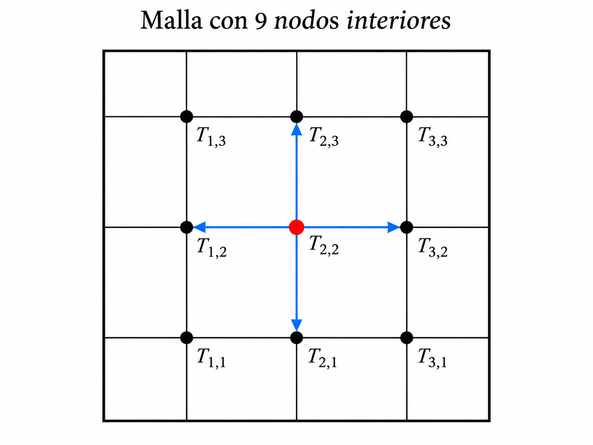

# Objetivos de la sesión

Al final de esta sesión queremos entender por qué, para ciertos sistemas lineales grandes y dispersos, puede ser más conveniente **iterar** que aplicar directamente eliminación de Gauss.

La ruta será

$$
\boxed{
\text{problema físico}
\longrightarrow
\text{matriz dispersa}
\longrightarrow
\text{Jacobi}
\longrightarrow
\text{Gauss--Seidel}
\longrightarrow
\text{SOR}
}
$$

y todo lo implementaremos en **Julia**.

---

# ¿De dónde sale la ecuación que vamos a resolver?

Consideremos una placa delgada cuya temperatura depende de la posición y del tiempo:

$$
T=T(x,y,t).
$$

La idea física básica es una ley de balance:

> Si en una pequeña región entra más calor del que sale, su energía interna aumenta; si sale más calor del que entra, disminuye.

La **ley de Fourier** establece que el flujo de calor es proporcional al gradiente negativo de la temperatura:

$$
\mathbf{q}=-k\nabla T,
$$

donde $k>0$ es la conductividad térmica del material.

El signo negativo tiene una interpretación física muy sencilla: el calor fluye de las regiones de mayor temperatura hacia las de menor temperatura.

Por otra parte, la conservación de la energía conduce a

$$
\rho c\,\frac{\partial T}{\partial t}
=
-\nabla\cdot\mathbf{q},
$$

donde

- $\rho$ es la densidad del material,
- $c$ es su calor específico.

Sustituyendo la ley de Fourier,

$$
\rho c\,\frac{\partial T}{\partial t}
=
\nabla\cdot(k\nabla T).
$$

Si el material es homogéneo y $k$ es constante,

$$
\rho c\,\frac{\partial T}{\partial t}
=
k\nabla^2T.
$$

Definiendo la **difusividad térmica**

$$
\alpha=\frac{k}{\rho c},
$$

obtenemos la ecuación del calor:

$$
\boxed{
\frac{\partial T}{\partial t}
=
\alpha\nabla^2T
}
$$

En dos dimensiones,

$$
\boxed{
\frac{\partial T}{\partial t}
=
\alpha
\left(
\frac{\partial^2T}{\partial x^2}
+
\frac{\partial^2T}{\partial y^2}
\right)
}
$$

# Régimen estacionario: aparece la ecuación de Laplace

Ahora supongamos que ha transcurrido suficiente tiempo para que la distribución de temperatura ya no cambie con $t$. Entonces

$$
\frac{\partial T}{\partial t}=0.
$$

La ecuación del calor se reduce a

$$
\boxed{
\frac{\partial^2T}{\partial x^2}
+
\frac{\partial^2T}{\partial y^2}
=0
}
$$

Ésta es la **ecuación de Laplace**.

Así que no apareció por decreto celestial: es el caso estacionario de la ecuación del calor cuando no hay fuentes internas.

La ruta física y numérica que seguiremos es

$$
\boxed{
\text{conservación de energía}
\longrightarrow
\text{ley de Fourier}
\longrightarrow
\text{ecuación del calor}
\longrightarrow
\text{Laplace}
\longrightarrow
\text{diferencias finitas}
\longrightarrow
Ax=b
}
$$

# De la ecuación de Laplace al sistema lineal

Usando diferencias finitas centrales con paso $h$,

$$
\frac{T_{i+1,j}-2T_{i,j}+T_{i-1,j}}{h^2}
+
\frac{T_{i,j+1}-2T_{i,j}+T_{i,j-1}}{h^2}
=0.
$$

Multiplicando por $h^2$,

$$
T_{i+1,j}+T_{i-1,j}+T_{i,j+1}+T_{i,j-1}
-4T_{i,j}=0.
$$

Por tanto,

$$
\boxed{
T_{i,j}
=
\frac14\left(
T_{i+1,j}+T_{i-1,j}+T_{i,j+1}+T_{i,j-1}
\right)
}
$$

La temperatura en un nodo interior es el promedio de las temperaturas de sus cuatro vecinos.

{fig-align="center" width="70%"}

## ¿Qué tiene que ver esto con sistemas lineales?

Si numeramos los nodos interiores, las ecuaciones de diferencias finitas producen un sistema

$$
AT=b.
$$

Para una malla de $3\times 3$ nodos interiores obtenemos nueve incógnitas. Cada ecuación sólo conecta un nodo con sus vecinos, por lo que la matriz contiene muchos ceros.

Ésta es la primera idea importante:

$$
\boxed{\text{la matriz es dispersa y tiene estructura}}
$$

Cuando la malla crece, también crece el número de incógnitas, pero cada fila sigue teniendo muy pocos elementos distintos de cero.

---

# ¿Por qué no usar siempre eliminación de Gauss?

Los métodos directos son excelentes y, en aritmética exacta, producen la solución en un número finito de operaciones.

Pero en un sistema grande y disperso, una eliminación puede producir **fill-in**: posiciones que originalmente eran cero se vuelven no nulas durante la factorización.

Esto puede aumentar:

- el almacenamiento,
- el tiempo de cómputo,
- y la pérdida de la estructura original.

Los métodos iterativos, en cambio, pueden trabajar directamente con las relaciones locales del problema.

En algunos casos ni siquiera necesitamos almacenar la matriz $A$ completa.

---

# Idea general de un método iterativo

Queremos resolver

$$
Ax=b.
$$

En vez de obtener $x$ de una sola vez, empezamos con una aproximación

$$
x^{(0)}
$$

y construimos una sucesión

$$
x^{(0)},x^{(1)},x^{(2)},\ldots
$$

esperando que

$$
x^{(k)}\to x.
$$

Una medida natural de qué tan bien estamos resolviendo el sistema es el **residuo**

$$
r^{(k)}=b-Ax^{(k)}.
$$

Si

$$
\|r^{(k)}\|_2
$$

es pequeño, entonces $x^{(k)}$ satisface aproximadamente el sistema.

---

# Método de Jacobi

La ecuación $i$-ésima de

$$
Ax=b
$$

es

$$
a_{ii}x_i+\sum_{j\ne i}a_{ij}x_j=b_i.
$$

Despejamos $x_i$:

$$
x_i=
\frac{1}{a_{ii}}
\left(
b_i-\sum_{j\ne i}a_{ij}x_j
\right).
$$

Jacobi usa en el lado derecho **solamente valores de la iteración anterior**:

$$
\boxed{
x_i^{(k+1)}
=
\frac{1}{a_{ii}}
\left(
b_i-\sum_{j\ne i}a_{ij}x_j^{(k)}
\right)
}
$$

## Ejemplo

Consideremos el sistema

$$
\begin{aligned}
4x_1-x_2+x_3 &=12,\\
-x_1+4x_2-2x_3 &=-1,\\
x_1-2x_2+4x_3 &=5.
\end{aligned}
$$

Despejando:

$$
x_1=\frac14(12+x_2-x_3),
$$

$$
x_2=\frac14(-1+x_1+2x_3),
$$

$$
x_3=\frac14(5-x_1+2x_2).
$$

Tomemos

$$
x^{(0)}=(0,0,0)^T.
$$

La primera iteración de Jacobi es

$$
x_1^{(1)}=3,
\qquad
x_2^{(1)}=-0.25,
\qquad
x_3^{(1)}=1.25.
$$

Obsérvese que los tres valores fueron calculados usando exclusivamente $x^{(0)}$.

---

# Jacobi en Julia

```{julia}
using LinearAlgebra
```

```{julia}
function jacobi(A, b; x0=zeros(length(b)), tol=1e-10, maxiter=10_000)

    n = length(b)
    xold = copy(x0)
    xnew = similar(xold)
    historia = Float64[]

    for k in 1:maxiter

        for i in 1:n
            s = 0.0
            for j in 1:n
                if j != i
                    s += A[i,j] * xold[j]
                end
            end
            xnew[i] = (b[i] - s) / A[i,i]
        end

        r = norm(b - A*xnew)
        push!(historia, r)

        if r < tol
            return copy(xnew), k, historia
        end

        xold .= xnew
    end

    return copy(xnew), maxiter, historia
end
```

Probemos:

```{julia}
A = [
     4.0 -1.0  1.0
    -1.0  4.0 -2.0
     1.0 -2.0  4.0
]

b = [12.0, -1.0, 5.0]

xJ, itJ, histJ = jacobi(A,b)

println("Jacobi")
println("x = ", xJ)
println("iteraciones = ", itJ)
println("||b-Ax||₂ = ", norm(b-A*xJ))
```

La solución es

$$
x=
\begin{pmatrix}
3\\1\\1
\end{pmatrix}.
$$

---

# De Jacobi a Gauss--Seidel

Ahora aparece una pregunta muy sencilla.

Supongamos que ya calculamos

$$
x_1^{(k+1)}.
$$

Cuando vayamos a calcular

$$
x_2^{(k+1)},
$$

¿por qué usar el valor viejo $x_1^{(k)}$ si ya conocemos uno nuevo?

Gauss--Seidel utiliza siempre la información más reciente disponible:

$$
\boxed{
x_i^{(k+1)}
=
\frac{1}{a_{ii}}
\left[
b_i
-\sum_{j<i}a_{ij}x_j^{(k+1)}
-\sum_{j>i}a_{ij}x_j^{(k)}
\right]
}
$$

Ésa es la diferencia esencial.

---

# Gauss--Seidel a mano

Partimos otra vez de

$$
x^{(0)}=(0,0,0)^T.
$$

Primero:

$$
x_1^{(1)}
=
\frac14(12+0-0)
=
3.
$$

Ahora utilizamos ese nuevo valor para calcular $x_2$:

$$
x_2^{(1)}
=
\frac14[-1+3+2(0)]
=
0.5.
$$

Y usamos inmediatamente los valores nuevos disponibles para calcular $x_3$:

$$
x_3^{(1)}
=
\frac14[5-3+2(0.5)]
=
0.75.
$$

Así,

$$
x^{(1)}
=
\begin{pmatrix}
3\\0.5\\0.75
\end{pmatrix}.
$$

La segunda iteración produce aproximadamente

$$
x^{(2)}
=
\begin{pmatrix}
2.9375\\
0.859375\\
0.9453125
\end{pmatrix}.
$$

Y las iteraciones continúan acercándose a

$$
(3,1,1)^T.
$$

---

# Gauss--Seidel en Julia

```{julia}
function gauss_seidel(A, b; x0=zeros(length(b)), tol=1e-10, maxiter=10_000)

    n = length(b)
    x = copy(x0)
    historia = Float64[]

    for k in 1:maxiter

        for i in 1:n
            s = 0.0
            for j in 1:n
                if j != i
                    s += A[i,j] * x[j]
                end
            end
            x[i] = (b[i] - s) / A[i,i]
        end

        r = norm(b - A*x)
        push!(historia, r)

        if r < tol
            return copy(x), k, historia
        end
    end

    return copy(x), maxiter, historia
end
```

```{julia}
xGS, itGS, histGS = gauss_seidel(A,b)

println("Gauss-Seidel")
println("x = ", xGS)
println("iteraciones = ", itGS)
println("||b-Ax||₂ = ", norm(b-A*xGS))
```

---

# Comparación Jacobi vs Gauss--Seidel

```{julia}
println("Jacobi:       ", itJ,  " iteraciones")
println("Gauss-Seidel: ", itGS, " iteraciones")
```

Podemos observar la historia del residuo.

```{julia}
using Plots

plot(
    1:length(histJ), histJ,
    yscale=:log10,
    xlabel="Iteración",
    ylabel="||b-Ax||₂",
    label="Jacobi",
    linewidth=2
)

plot!(
    1:length(histGS), histGS,
    label="Gauss-Seidel",
    linewidth=2
)
```

---

# Relajación

Gauss--Seidel produce un valor propuesto que denotaremos por

$$
\widehat{x}_i.
$$

En vez de aceptar completamente ese valor, podemos combinarlo con el valor anterior:

$$
\boxed{
x_i^{\text{nuevo}}
=
\omega \widehat{x}_i
+
(1-\omega)x_i^{\text{viejo}}
}
$$

donde $\omega$ es el **factor de relajación**.

## Tres casos

Si

$$
\omega=1,
$$

obtenemos Gauss--Seidel.

Si

$$
0<\omega<1,
$$

tenemos **subrelajación**.

Si

$$
1<\omega<2,
$$

tenemos **sobrerrelajación**.

El método de sobrerrelajación sucesiva se conoce como

$$
\boxed{\text{SOR}}
$$

por *Successive Over-Relaxation*.

---

# SOR en Julia

```{julia}
function sor(A, b; omega=1.0, x0=zeros(length(b)),
             tol=1e-10, maxiter=10_000)

    n = length(b)
    x = copy(x0)
    historia = Float64[]

    for k in 1:maxiter

        xold = copy(x)

        for i in 1:n

            s = 0.0

            for j in 1:n
                if j != i
                    s += A[i,j] * x[j]
                end
            end

            xgs = (b[i] - s) / A[i,i]

            x[i] = omega*xgs + (1-omega)*xold[i]
        end

        r = norm(b-A*x)
        push!(historia,r)

        if r < tol
            return copy(x), k, historia
        end
    end

    return copy(x), maxiter, historia
end
```

Probemos varios valores de $\omega$:

```{julia}
for omega in [0.7, 1.0, 1.1, 1.2, 1.5]
    x, it, hist = sor(A,b,omega=omega)
    println("ω = ", omega,
            "   iteraciones = ", it,
            "   residuo = ", hist[end])
end
```

La pregunta que queda abierta es:

$$
\boxed{\text{¿cómo elegir un buen }\omega?}
$$

---

# La idea de Kiusalaas para estimar $\omega$

Kiusalaas propone estimar el factor de relajación durante la ejecución.

Sea

$$
\Delta x^{(k)}
=
\left\|
x^{(k)}-x^{(k-1)}
\right\|.
$$

Primero se realizan varias iteraciones con

$$
\omega=1.
$$

Después se comparan dos cambios separados por $p$ iteraciones.

Una aproximación utilizada por Kiusalaas es

$$
\boxed{
\omega_{\text{opt}}
\approx
\frac{2}{
1+\sqrt{
1-
\left(
\frac{\Delta x^{(k+p)}}{\Delta x^{(k)}}
\right)^{1/p}
}}
}
$$

si la cantidad dentro de la raíz es positiva.

La estrategia es:

1. hacer $k$ iteraciones con $\omega=1$;
2. guardar $\Delta x^{(k)}$;
3. hacer $p$ iteraciones adicionales;
4. guardar $\Delta x^{(k+p)}$;
5. estimar $\omega_{\text{opt}}$;
6. continuar con ese valor.

---

# Traducción a Julia del algoritmo de Kiusalaas

La siguiente función sigue la lógica del algoritmo presentado por Kiusalaas, pero está escrita en Julia.

```{julia}
function gauss_seidel_relajado(iterEqs, x;
                               tol=1e-9,
                               maxiter=500,
                               k0=10,
                               p=1)

    omega = 1.0
    dx1 = NaN

    for iter in 1:maxiter

        xold = copy(x)

        x = iterEqs(x, omega)

        dx = norm(x - xold)

        if dx < tol
            return x, iter, omega
        end

        if iter == k0
            dx1 = dx
        end

        if iter == k0 + p

            dx2 = dx
            q = (dx2/dx1)^(1/p)

            if 0 < q < 1
                omega = 2/(1 + sqrt(1-q))
            end
        end
    end

    return x, maxiter, omega
end
```

---

# Un sistema cíclico tridiagonal

Kiusalaas estudia el sistema de $n$ ecuaciones cuya estructura es esencialmente

$$
2x_i-x_{i-1}-x_{i+1}=0,
$$

con modificaciones en la primera y última ecuaciones que conectan $x_1$ y $x_n$.

La ventaja es que no necesitamos formar una matriz $n\times n$.

Podemos escribir directamente las ecuaciones iterativas.

Para este problema:

$$
x_1
=
\frac{x_2-x_n}{2},
$$

$$
x_i
=
\frac{x_{i-1}+x_{i+1}}{2},
\qquad
i=2,\ldots,n-1,
$$

y

$$
x_n
=
\frac{1-x_1+x_{n-1}}{2}.
$$

Con relajación:

$$
x_i^{\text{nuevo}}
=
\omega x_i^{GS}
+
(1-\omega)x_i^{\text{viejo}}.
$$

---

# Ecuaciones iterativas en Julia

```{julia}
function iterEqs_ciclico(x, omega)

    n = length(x)

    x[1] =
        omega*(x[2] - x[n])/2 +
        (1-omega)*x[1]

    for i in 2:n-1
        x[i] =
            omega*(x[i-1] + x[i+1])/2 +
            (1-omega)*x[i]
    end

    x[n] =
        omega*(1 - x[1] + x[n-1])/2 +
        (1-omega)*x[n]

    return x
end
```

Tomemos $n=20$:

```{julia}
n = 20
x0 = zeros(n)

xrel, itrel, omega_est =
    gauss_seidel_relajado(iterEqs_ciclico, x0)

println("Número de iteraciones = ", itrel)
println("Factor de relajación estimado = ", omega_est)
println("Solución = ")
display(xrel)
```

La solución exacta de este problema es

$$
x_i=-\frac{n}{4}+\frac{i}{2},
\qquad
i=1,\ldots,n.
$$

Podemos compararla:

```{julia}
xexacta = [-n/4 + i/2 for i in 1:n]

println("Error = ", norm(xrel-xexacta))
```

---

# La estructura vale más que la matriz completa

El ejemplo anterior muestra una idea fundamental.

Para resolver un sistema grande y estructurado, a veces no necesitamos almacenar

$$
A.
$$

Sólo necesitamos saber **cómo actúan las ecuaciones sobre el vector**.

En el problema cíclico cada componente depende únicamente de unos cuantos vecinos.

La memoria requerida crece aproximadamente como

$$
O(n)
$$

en vez de almacenar los

$$
n^2
$$

elementos de una matriz densa.

---

# Convergencia: una primera mirada

Los métodos estacionarios pueden escribirse en la forma

$$
x^{(k+1)}=Tx^{(k)}+c.
$$

La condición fundamental de convergencia es

$$
\boxed{
\rho(T)<1
}
$$

donde $\rho(T)$ es el radio espectral de la matriz de iteración.

Una condición suficiente muy utilizada es la **dominancia diagonal estricta**:

$$
|a_{ii}|
>
\sum_{j\ne i}|a_{ij}|.
$$

Pero debe quedar claro:

$$
\boxed{\text{la dominancia diagonal es suficiente, no necesaria}}
$$

Un sistema puede converger aunque no sea estrictamente diagonal dominante.

---

# Volvemos a la placa

Para la placa, Gauss--Seidel puede implementarse directamente sobre la malla:

$$
T_{i,j}
\leftarrow
\frac14
\left(
T_{i-1,j}
+T_{i+1,j}
+T_{i,j-1}
+T_{i,j+1}
\right).
$$

Y con SOR,

$$
T_{i,j}^{\text{nuevo}}
=
\omega T_{i,j}^{GS}
+
(1-\omega)T_{i,j}^{\text{viejo}}.
$$

Esto evita construir explícitamente la matriz del sistema.

Ésa es la conexión entre:

$$
\text{EDP}
\longrightarrow
\text{diferencias finitas}
\longrightarrow
\text{sistema disperso}
\longrightarrow
\text{iteración local}.
$$

---

# Una placa pequeña en Julia

Vamos a resolver una placa cuadrada sencilla.

Tomaremos:

- borde superior: $100$,
- borde inferior: $0$,
- bordes izquierdo y derecho: $0$.

```{julia}
function placa_gauss_seidel(n;
                            top=100.0,
                            bottom=0.0,
                            left=0.0,
                            right=0.0,
                            omega=1.0,
                            tol=1e-8,
                            maxiter=50_000)

    T = zeros(n+2,n+2)

    T[1,:] .= top
    T[end,:] .= bottom
    T[:,1] .= left
    T[:,end] .= right

    historia = Float64[]

    for k in 1:maxiter

        Told = copy(T)

        for i in 2:n+1
            for j in 2:n+1

                Tgs = 0.25*(
                    T[i-1,j] +
                    T[i+1,j] +
                    T[i,j-1] +
                    T[i,j+1]
                )

                T[i,j] =
                    omega*Tgs +
                    (1-omega)*T[i,j]
            end
        end

        cambio = norm(T-Told)
        push!(historia,cambio)

        if cambio < tol
            return T,k,historia
        end
    end

    return T,maxiter,historia
end
```

Probemos:

```{julia}
T, itT, histT = placa_gauss_seidel(20, omega=1.0)

println("Iteraciones = ", itT)
```

Y dibujamos la temperatura:

```{julia}
heatmap(
    T,
    xlabel="x",
    ylabel="y",
    title="Temperatura estacionaria",
    aspect_ratio=:equal
)
```

---

# Efecto de la relajación en la placa

Comparemos varios valores de $\omega$.

```{julia}
for omega in [0.8, 1.0, 1.2, 1.5, 1.7]

    Tω, itω, histω =
        placa_gauss_seidel(20, omega=omega)

    println(
        "ω = ",
        omega,
        "   iteraciones = ",
        itω
    )
end
```

Ahora ya podemos discutir experimentalmente:

> ¿La sobrerrelajación siempre ayuda?

No necesariamente.

Un $\omega$ adecuado puede acelerar mucho la convergencia, pero un valor mal elegido puede empeorarla o incluso producir divergencia.

---

# Resumen

La sesión puede resumirse con cuatro ideas.

## La estructura importa

Los sistemas provenientes de discretizaciones suelen ser grandes y dispersos.

## Jacobi

Usa solamente valores de la iteración anterior.

## Gauss--Seidel

Usa inmediatamente la información recién calculada.

## SOR

Introduce un factor de relajación

$$
\omega
$$

para intentar acelerar la convergencia.

---

# Ejercicios

## Ejercicio 1

Realice dos iteraciones de Jacobi para

$$
\begin{pmatrix}
4&-1&0\\
-1&4&-1\\
0&-1&4
\end{pmatrix}
x
=
\begin{pmatrix}
3\\2\\3
\end{pmatrix}
$$

partiendo de

$$
x^{(0)}=0.
$$

## Ejercicio 2

Repita el ejercicio anterior con Gauss--Seidel.

Compare ambas aproximaciones.

## Ejercicio 3

Use Julia para comparar Jacobi y Gauss--Seidel mediante

$$
\|b-Ax^{(k)}\|_2.
$$

## Ejercicio 4

Para el mismo sistema pruebe SOR con

$$
\omega=0.8,\quad 1.0,\quad 1.2,\quad 1.5.
$$

Compare el número de iteraciones.

## Ejercicio 5

Modifique el tamaño de la placa:

$$
n=10,\quad 20,\quad 40.
$$

Observe cómo cambia el número de iteraciones.

## Ejercicio 6

Explique por qué en el problema de la placa no es indispensable formar explícitamente la matriz $A$.

## Ejercicio 7

Para el sistema cíclico con $n=20$, compare:

- Gauss--Seidel con $\omega=1$;
- Gauss--Seidel con $\omega$ estimado automáticamente.

---

# Lo que viene: gradiente conjugado

En la siguiente sesión estudiaremos un método especialmente importante para sistemas grandes, dispersos, simétricos y definidos positivos.

La idea comienza con la función

$$
f(x)=\frac12x^TAx-b^Tx.
$$

Como

$$
\nabla f(x)=Ax-b,
$$

resolver

$$
Ax=b
$$

equivale a encontrar el mínimo de $f$.

Esto nos llevará a:

$$
\boxed{\text{Gradiente Conjugado}}
$$

y veremos por qué puede ser extraordinariamente eficiente en problemas grandes.
